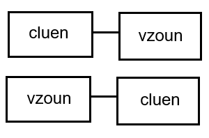
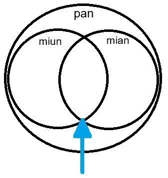
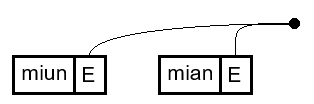

import Blockquote from "../../components/Blockquote.astro";
import DictEntry from "../../components/DictEntry";
import Info from "../../components/Info.astro";

<Info type="warning" title="images">
These images are low-quality. Higher-quality images are on their way.
</Info>

<Blockquote cite="Mia Entropy">
Once you get chaining the whole language gets easy :p
</Blockquote>

<Info type="jargon" title="Chaining">
Chaining is the process of how two side-by-side predicates combine to form a new
predicate.
</Info>

Thus far we've only made one-word sentences, so how do we speak sentences packed
full of predicates?

We take the two right-most predicates, then chain the left to the right. Rinse
and repeat.

TODO maybe move this to after relatiosn?

<Info type="examples">
`pa [p1 [p2 [p3 [p4 p5]]]]`

The first chained predicate is "p4 p5", which "p3" chains to, forming
"p3 p4 p5". This continues until we get the predicate "p1 p2 p3 p4 p5", which
then gets asserted by "pa".
</Info>

The actual details of this process depend on the predicates that we're
chaining.

## Propositions

Propositions have no overt places, so there's no binding. We chain two
propositions together using "and" (logical conjunction) to form a larger
compound proposition.

Since we chain with "and", the order does not matter.

<Info type="examples">
- <DictEntry client:load id="eebgcxilaa" /> {/* cluen */}
- <DictEntry client:load id="jl7ojeesj9" /> {/* vzoun*/}
- pa cluen vzoun
  - Translation: "It's a summer's evening."
  - Literally: "It is summer and it is evening."
- pa vzoun cluen
  - Translation: "It's an evening of summer."
  - Literally: "It is evening and it is summer."
</Info>

Here's what the chained predicates look like:

Lacking overt places, propositions are limited in what meaning they can express.

## Properties

Properties have one overt place, "E". How they're bound depends on whether it's
an atom place or a predicate place.

### Atom places

Atoms have no intrinsic meaning—they're not in Eberban's vocabulary and you
won't see them in sentences. Instead, we rely on Arity Mismatch Resolution to
create them as existential atom arguments.

When the quantity and type of all bound atom places are compatible, the order of
atom-place properties does not matter. In these example sentences, each atom place has
the same quantity and type.

<Info type="examples">
- <DictEntry client:load id="mu4oshpucp" /> {/* miun */}
- <DictEntry client:load id="vgeqteao1c" /> {/* mian */}
- pa miun mian
  - Translation: "There exists some cat+ that's sleeping."
  - Literally: "There exists some physical entity+ _e_, which is a cat and is
  sleeping."
- pa mian miun
  - Translation: "There exists some sleeping thing+ which is a cat."
  - Literally: "There exists some physical entity+ _e_, which is sleeping and is
  a cat."
</Info>

We can think of binding a predicate to an existential atom argument as
"atom describing". With each binding, the quantity (e.g., `tce*`), type
(e.g., `pan`), may be narrowed. In the above example sentences the properties
produce a new type.

Here is a chaining diagram to visualise how two atom-place properties are
chained together:

The black dot represents an atom, though this isn't created until there's an
arity mismatch (e.g., "pa miun mian").

### Predicate places

When chaining two predicate-place properties, the left's "E" place takes the
right predicate as its argument. Thus, the order of predicate-place properties
does matter.

<Info type="examples">
- <DictEntry client:load id="lsnj8jjkmu" /> {/* zvaor */}
- It's funny that E:() is true
- pa zvaor funny
  - Translation: "It isn't meant to be funny that there exists some proposition
  _E_."
  - Literally: "It is unintentional that it's funny that there exists some
  proposition _E_."
</Info>

We can think of binding predicates to predicate arguments as
"predicate stacking". Each predicate affects the meaning of all the predicates
below it.

Here's a chaining diagram to visualise how two predicate-place properties are
chained together: TODO

"funny" became a proposition to resolve the arity mismatch.

### Default binds

Some places are often bound to the same arguments, so Eberban lists these as
defaults. When using such predicates the order does matter as we can override
the default binding.

<Info type="examples">
- <DictEntry client:load id="pne1nwyhy8" /> {/* mlial */}
- <DictEntry client:load id="afkl3d764n" /> {/* meul */}
- <DictEntry client:load id="ymuvroa9iu" /> {/* pafken */}
- <DictEntry client:load id="6rko2uu7va" /> {/* cfen */}
- pa mlial (The air is warm.)
- pa pafken mlial (There exists some potato+ that is warm.)
- pa meul (There exists some water+ that is raining.)
- pa cfen meul (There exists some liquid+ that is raining.)
</Info>

### Binding with propositions

<Info type="reminder" title="Arity mismatch">
An arity mismatch happens when the expected arity of the left word is less than
the actual arity of the right.
</Info>

A proposition (0-ary) chained to a property (1-ary) results in an arity
mismatch.

A property (1-ary) chained to a proposition (0-ary) results in an unused "E"
place.

When it's only the proposition and the property, you can get the same meaning
for any order.

<Info type="examples">
- pa mian vzoun (There exists some cat+ and it is evening.)
- pa vzoun mian (It is evening and there exists some cat+.)
</Info>

Now let's say we have a sentence of two propositions and one property. Now the
order matters. When the proposition is between the two properties, Arity
Mismatch Resolution happens twice.

<Info type="examples">
pa miun vzoun mian

There exists some physical entity+ _e2_, which is sleeping; it is evening, and
there exists some physical entity _e1_, which is a cat.
</Info>

First "vzoun" chains to "mian", and then "miun" chains to "vzoun mian".

## Relations

draft:

Relations have two places. They look different as well. All relations and higher-arity predicates are transitive.

Jargon: transitivity

A predicate's transitivity denotes which of its places chaining selects by default.

A predicate is intransitive if it selects no place or the E place by default. All propositions and properties are intransitive.

A predicate is transitive if it selects the A place by default. All relations and higher arity predicates are transitive.

Relations have two places

We teach how to modify predicates with particles to change this behaviour in the place selection chapter]

A predicate that has two placeses is HUGE 
atoms -- transi, composes, relates, interacts
predicates --can connect in different ways (OR)
atom/predicate -- can comprehend/express propositiosn etc specify filter etc

---

### Which place?

-transitivity, E or A
Talk about syntax = same but semantics depends on type (transitivity talked about in relations)

3-ary and above will be talked about more in place selection (as O, U and
others aren't exposed t ochaining by default)

### Save higher arity predicates for the Place Selecting chapter

## Brackets

## Chaining Nonsense

will always evaluate to proveably false

chaining an atom-typed place to a predicate-typed place:
-pa mian zvaor

atom-type mismatch

pa eberban pcien and pa pcien eberban (pan =/= ban -> nonsense -> false)

quantity mismatch

tce tco 

future: coriu, future: zmen (both are relations)

TODO: move quantity annotation from Eberban Predicates to Arity Mismatch Resolution
