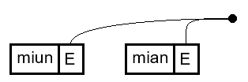
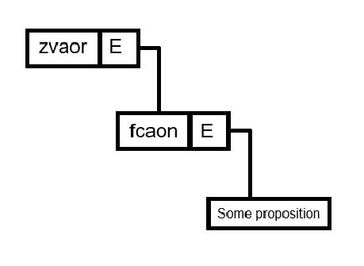

import Blockquote from "../../components/Blockquote.astro";
import DictEntry from "../../components/DictEntry";
import Info from "../../components/Info.astro";

<Info type="warning" title="images">
These images are low-quality. Higher-quality images are on their way.
</Info>

<Blockquote cite="Mia Entropy">
Once you get chaining the whole language gets easy :p
</Blockquote>

<Info type="jargon" title="Chaining">
Chaining is the process of how two side-by-side predicates combine to form a new
predicate.
</Info>

Thus far we've only made one-word sentences, so how do we speak sentences packed
full of predicates?

We take the two right-most predicates, then chain the left to the right. Rinse
and repeat.

TODO maybe move this to after relatiosn?

TODO mention duplicate predicates?  pa mian mian === pa mian

<Info type="examples">
`pa [p1 [p2 [p3 [p4 p5]]]]`

The first chained predicate is "p4 p5", which "p3" chains to, forming
"p3 p4 p5". This continues until we get the predicate "p1 p2 p3 p4 p5", which
then gets asserted by "pa".
</Info>

The actual details of this process depend on the predicates that we're
chaining.

## Propositions

Propositions have no overt places, so there's no binding. We chain two
propositions together using "and" (logical conjunction) to form a larger
compound proposition.

Since we chain with "and", the order does not matter.

<Info type="examples">
- <DictEntry client:load id="eebgcxilaa" /> {/* cluen */}
- <DictEntry client:load id="jl7ojeesj9" /> {/* vzoun*/}
- pa cluen vzoun
  - Translation: "It's a summer's evening."
  - Literally: "It is summer and it is evening."
- pa vzoun cluen
  - Translation: "It's an evening of summer."
  - Literally: "It is evening and it is summer."
</Info>

Here's what the chained predicates look like:

Lacking overt places, propositions are limited in what meaning they can express.

## Properties

Properties have one overt place: "E". How they're bound depends on whether it's
an atom place or a predicate place.

### Atom places

Atoms have no intrinsic meaning—they're not in Eberban's vocabulary and you
won't see them in sentences. Instead, we rely on Arity Mismatch Resolution to
create them as existential atom arguments.

When the quantity and type of all bound atom places are compatible, the order of
atom-place properties does not matter. In these example sentences, each atom place has
the same quantity and type.

<Info type="examples">
- <DictEntry client:load id="mu4oshpucp" /> {/* miun */}
- <DictEntry client:load id="vgeqteao1c" /> {/* mian */}
- pa miun mian
  - Translation: "There exists some cat+ that's sleeping."
  - Literally: "There exists some physical entity+ _e_, which is a cat and is
  sleeping."
- pa mian miun
  - Translation: "There exists some sleeping thing+ which is a cat."
  - Literally: "There exists some physical entity+ _e_, which is sleeping and is
  a cat."
</Info>

We can think of binding a predicate to an existential atom argument as
"atom describing". With each binding, the quantity (e.g., `tce*`), type
(e.g., `pan`), may be narrowed. In the above example sentences the properties
produce a new type.

Here is a chaining diagram to visualise how two atom-place properties are
chained together:

The black dot represents an atom, though this isn't created until there's an
arity mismatch (e.g., "pa miun mian").

### Predicate places

When chaining two predicate-place properties, the left's "E" place takes the
right predicate as its argument. Thus, the order of predicate-place properties
does matter.

<Info type="examples">
- <DictEntry client:load id="lsnj8jjkmu" /> {/* zvaor */}
- <DictEntry client:load id="atpt42rrzm" /> {/* fcaon */}
- pa zvaor funny
  - Translation: "It isn't meant to be funny that there exists some proposition
  _E_."
  - Literally: "It is unintentional that it's funny that there exists some
  proposition _E_."
</Info>

We can think of binding predicates to predicate arguments as
"predicate stacking". Each predicate affects the meaning of all the predicates
below it.

Here's a chaining diagram to visualise how two predicate-place properties are
chained together:

The existential proposition argument "some proposition" was created to resolve
the arity mismatch.

### Default binds

Some places are often bound to the same arguments, so Eberban lists these as
defaults. When using such predicates the order does matter as we can override
the default binding.

<Info type="examples">
- <DictEntry client:load id="pne1nwyhy8" /> {/* mlial */}
- <DictEntry client:load id="afkl3d764n" /> {/* meul */}
- <DictEntry client:load id="ymuvroa9iu" /> {/* pafken */}
- <DictEntry client:load id="6rko2uu7va" /> {/* cfen */}
- pa mlial (The air is warm.)
- pa pafken mlial (There exists some potato+ that is warm.)
- pa meul (There exists some water+ that is raining.)
- pa cfen meul (There exists some liquid+ that is raining.)
</Info>

### Binding with propositions

<Info type="reminder" title="Arity mismatch">
Given two side-by-side words, an arity mismatch occurs when the expected arity
of the left is less than the actual arity of the right.
</Info>

A proposition (0-ary) chained to a property (1-ary) results in an arity
mismatch.

A property (1-ary) chained to a proposition (0-ary) results in an unused "E"
place.

When it's only the proposition and the property, you can get the same meaning
for any order.

<Info type="examples">
- pa mian vzoun (There exists some cat+ and it is evening.)
- pa vzoun mian (It is evening and there exists some cat+.)
</Info>

Now let's say we have a sentence of two propositions and one property. Now the
order matters. When the proposition is between the two properties, Arity
Mismatch Resolution happens twice.

<Info type="examples">
pa miun vzoun mian

There exists some physical entity+ _e2_, which is sleeping, and it is evening,
and there exists some physical entity _e1_, which is a cat.
</Info>

First "vzoun" chains to "mian", and then "miun" chains to "vzoun mian".

## Relations

Relations have two overt places: "E" and "A". 

With relations, we can form much more complex sentences:

- Atoms can interact with and relate to other atoms.
- Predicates can logically connect with other predicates.
- Atoms and predicates can relate to each other to express thought, reason,
sets, and systems.

This is all possible because relations are transitive.

<Info type="jargon" title="transitivity">
A predicate's transitivity denotes the place that chaining selects by default.

A predicate is intransitive if it either selects none or the "E" place by
default. All propositions and properties are intransitive.

A predicate is transitive if it selects the "A" place by default. All relations
and higher-arity predicates (3-ary, 4-ary, etc...) are transitive.
</Info>

Let's dive right into examples:

<Info type="examples">
- <DictEntry client:load id="eyxmjzfra3" /> {/* e tia denal */}
- <DictEntry client:load id="unfcuerxgm" /> {/* mi */}
- <DictEntry client:load id="zjytqy23pq" /> {/* mo */}
- <DictEntry client:load id="vgeqteao1c" /> {/* mian */}
- <DictEntry client:load id="la6bqysk7n" /> {/* mana */}
- <DictEntry client:load id="4hiwgkyaqe" /> {/* za */}
- <DictEntry client:load id=""> {/* e ber ban */}
- <DictEntry client:load id="fp326p16jr" /> {/* buri */}
- <DictEntry client:load id="r9jofkaowc" /> {/* viru */}
- <DictEntry client:load id="pvhoor5xeb" /> {/* tcu */}
- <DictEntry client:load id="iffa5o0qnw" /> {/* dona */}
- <DictEntry client:load id="jqzbvtnncw" /> {/* zidma */}
- <DictEntry client:load id="r7wbdwqgm0" /> {/* gli */}

- pa mian buri
   - Translation: "Some cat+ is eating."
   - Literally: "There exists some physical entity+ _e_, and some physical
   entity+ _a_, such that _e_, a cat, eats _a_."
- pa mi viru mana mo
   - Translation: "I+ see your mother+."
   - Literally: "There exists some physical entity+ _e_, and some physical
   entity+ _a_,  such that _e_, a speaker, sees _a_, a listener's mother."
- pa mi gli etiadenal
   - Translation: "I'm happy that it's Friday."
   - Literally: "There exists some physical entity+ _e_, a speaker, that is
   about the propostion "it is Friday" being true."
- pa mi dona tcu mian
   - Translation: "I like all cats."
   - Literally: "There exists some physical entity+ _e1_, and some set of atoms+
   _a_, such that _e1_, a speaker_, likes _a_, the set of all things that
   individually satisfy the property "is a cat"."
- pa eberban zidma za umia uentropi
   - Translation: The eberban language exists because of Mia Entropy.
  - Literally: It is true that there exists _e1_, the eberban language, because
  it is true that there exists some thing+ _e2_, named Mia Entropy."
</Info>

The A place of "buri" binds to the argument ""
Why A? because "buri" is transitive

## Chaining Nonsense 

TODO reword thsi section

If we chain incompatible predicates, we get nonsensical sentences. Nonsensical
sentences always evaluate to proveably false.

### Equating an atom to a predicate

pa mian zvaor 

Why is this nonsense?

- The E place of mian expects an atom of tce* pan, but receives a predicate. Atoms, non-predicates, are not predicates.

Reversing the two predicates works, though.

pa zvaor mian --< it is accidental that there exists some cat+

### Contradicting atom types

take image from Discord

pa eberban pcien
pa pcien eberban

one is type pan, the other is type ban

Describing an atom to have type "pan" and type non-"pan" is nonsensical. No quantum logic here lol

### property quantity mismatch

tce | Etcei is a (non-empty) set of some things >> a set of at least 1 thingA(p)
tco | Etcoi is a set of at least 2 things A(p)

pa tce tco
== tce set of at least 2 things satisfying some property A
== set of at least one thing satisfying property e is a set 

pa tce tco X (not compatible)

pa tco tce x (is compatible)

---

## Brackets -- explicit binding, first subheading of this chapter

TODO: mention binding more! Chaining 1-ary 2-ary 3-ary 4-ary... uses binding!

TODO: replace inner quotes with singular quotes

TODO: move quantity annotation from Eberban Predicates to Arity Mismatch Resolution

TODO: have separate vocab blocks? example blocks are quite big

TODO: We teach how to modify predicates with particles to change this behaviour in the place selection chapter]

TODO: note that literal translations will stop after this chapter.

NOTE FOR ME: from now on, organise example dictentires via arity (lower arity first)
check in previous chapters
